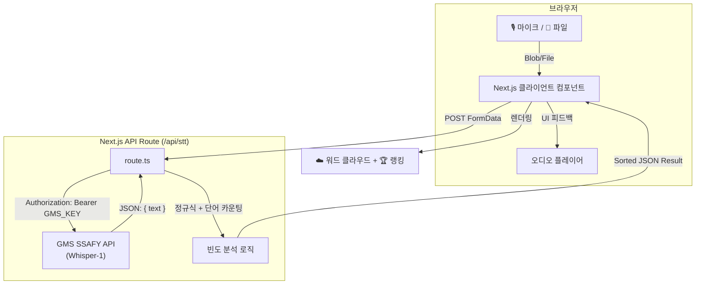

# 🎙️ I like Kwangsu

> **광수는 어떤 단어를 가장 많이 쓸까?**
> 한국어 음성 인식 기반 단어 빈도 분석 웹 서비스

음성을 실시간 녹음하거나 파일을 업로드하면, OpenAI Whisper STT로 텍스트를 변환하고 가장 많이 사용된 단어를 워드 클라우드와 랭킹으로 시각화합니다.

---
## 미리 보기
메인 화면

분석 화면


## ✨ 주요 기능

| 기능 | 설명 |
|------|------|
| 🎙️ **실시간 녹음** | 브라우저 마이크로 직접 녹음, 분석 전 미리듣기 지원 |
| 📁 **파일 업로드** | MP3 · WAV · M4A 등 기존 음성 파일 업로드 분석 |
| 🤖 **GMS STT** | SSAFY GMS 엔드포인트를 통해 OpenAI Whisper-1 호출 |
| ☁️ **워드 클라우드** | 빈도수에 비례한 폰트 크기로 시각적 키워드 표현 |
| 🏆 **Top 5 랭킹** | 가장 많이 사용된 단어 순위 리스트 |
| 📝 **STT 원문 표시** | 변환된 전체 텍스트 원문 확인 가능 |

---

## 🛠 기술 스택

### Framework
- **Next.js 16** (App Router) — 프론트엔드 + 백엔드 API Routes 통합

### UI / Design
- **Tailwind CSS v4** — 반응형 유틸리티 스타일링
- **Lucide React** — 아이콘
- **온글잎 박다현체** — 커스텀 한국어 웹폰트 (jsdelivr CDN)
- 디자인 토큰: 크림/노란 계열 배경 + 파스텔 파란 포인트 (`design.md` 참조)

### Audio & AI
- **MediaRecorder API** — 브라우저 기반 음성 캡처
- **GMS (SSAFY Generative Model Service)** — Whisper-1 Proxy API
- **Web Audio API** — 녹음 재생 관리

---

## 🏗 시스템 아키텍처



---

## 📁 프로젝트 구조

```
src/
├── app/
│   ├── page.tsx              # 메인 페이지 (상태 & 핸들러 컨테이너)
│   ├── layout.tsx            # 루트 레이아웃
│   ├── globals.css           # 전역 스타일 & 디자인 토큰
│   └── api/
│       └── stt/
│           └── route.ts      # STT 분석 API 엔드포인트
└── components/
    ├── Header.tsx            # 서비스명 + 서브타이틀
    ├── RecordingCard.tsx     # 녹음 시작/중지 + 미리듣기
    ├── FileUploadCard.tsx    # 파일 선택 + 분석 버튼
    ├── AnalysisReport.tsx    # 결과 패널 (서브컴포넌트 조합)
    ├── ResultBadges.tsx      # Total Keywords / Most Used 배지
    ├── TranscribedText.tsx   # STT 원문 표시
    ├── TopRanking.tsx        # Top 5 랭킹 리스트
    └── WordCloud.tsx         # 워드 클라우드 시각화
```

---

## ⚙️ 설치 및 실행

### 1. 환경 변수 설정

프로젝트 루트에 `.env.local` 파일을 생성합니다.

```env
GMS_KEY=your_gms_api_key_here
```

### 2. 의존성 설치

```bash
npm install
```

### 3. 개발 서버 실행

```bash
npm run dev
```

브라우저에서 [http://localhost:3000](http://localhost:3000) 접속 후 사용 가능합니다.

---

## 📝 단어 분석 방식

현재 분석 로직 (`/api/stt/route.ts`):

1. **STT 변환**: GMS 엔드포인트를 통해 Whisper-1이 음성을 텍스트로 변환
2. **정규식 전처리**: `.,/#!$%^&*;:{}=-_\`~()?\"'` 등 문장부호 제거
3. **단어 분리**: 공백(띄어쓰기) 기준으로 분리
4. **빈도 집계**: 단어별 등장 횟수 카운팅
5. **정렬**: 빈도 내림차순 정렬 후 응답

> **현재 한계**: 조사(은/는/이/가), 어미(했다/합니다) 등 포함하여 카운팅됨

---

## 🚀 개선 및 확장 아이디어

### 단기 개선
- [ ] **형태소 분석 도입**: `KoNLPy` 서버 연동 또는 클라이언트 사이드 `Hangul.js` 활용으로 조사·어미 제거 후 명사만 추출
- [ ] **불용어(Stopwords) 필터**: "이", "그", "저", "것" 등 빈도 높지만 의미 없는 단어 제외 목록 적용
- [ ] **분석 히스토리**: `localStorage`로 이전 분석 결과 저장 및 재조회
- [ ] **결과 공유/내보내기**: 분석 결과를 이미지(PNG) 또는 JSON으로 다운로드

### 중기 개선
- [ ] **Bar Chart 시각화**: `Chart.js` / `recharts`로 단어 빈도 막대 그래프 추가
- [ ] **여러 음성 비교**: 다수 파일을 올려 화자별 습관 단어 비교 기능
- [ ] **타임스탬프 기반 분석**: Whisper verbose JSON으로 시간대별 키워드 흐름 표시
- [ ] **다국어 지원**: `language` 파라미터 활용해 한국어 외 언어도 분석 가능하도록

### 장기 개선
- [ ] **실시간 STT**: WebSocket + Whisper Streaming으로 녹음 중 실시간 변환
- [ ] **AI 요약**: GPT API 연동으로 분석 결과 자동 요약문 생성
- [ ] **사용자 인증 & 마이페이지**: 로그인 후 분석 기록 영구 보관
- [ ] **모바일 앱**: React Native 또는 Flutter로 모바일 버전 확장

---

## ⚠️ 알려진 이슈

| 이슈 | 원인 | 해결 방법 |
|------|------|-----------|
| 개발 환경 Hydration 경고 | Endic 등 크롬 확장 프로그램이 DOM 수정 | 확장 프로그램 비활성화 또는 시크릿 모드 사용 |
| `reactStrictMode: false` | 위 Hydration 경고 노이즈 감소 목적 | 프로덕션 동작에는 영향 없음 |

---

## 📄 라이선스

- **온글잎 박다현체**: (주)보이저엑스 — [noonnu.cc](https://noonnu.cc) 라이선스 정책 확인 필요
- 소스 코드: 별도 라이선스 없음 (프라이빗 프로젝트)