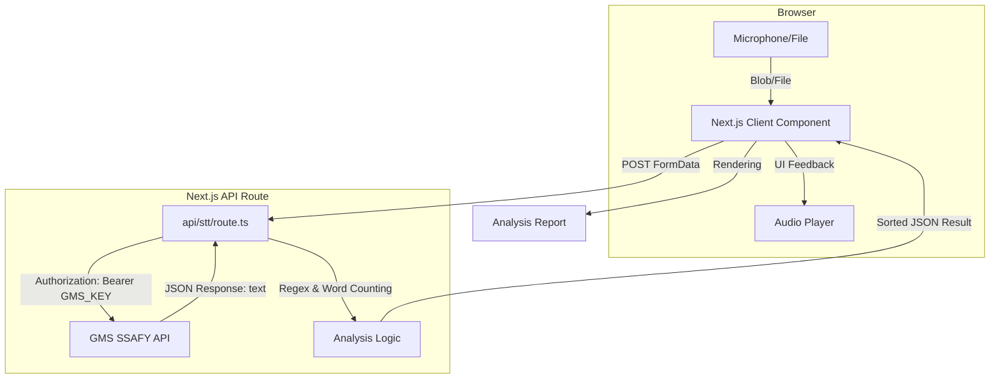

# 🎙️ Ko-WordCounter
> **한국어 음성 인식 기반 단어 빈도 분석 웹 서비스**

사용자의 음성을 실시간으로 녹음하거나 파일을 업로드하여 텍스트로 변환(STT)하고, 해당 텍스트 내에서 가장 많이 사용된 단어를 추출하여 시각화해주는 풀스택 웹 애플리케이션입니다.

## ✨ 주요 기능
- **실시간 녹음 및 재생**: 브라우저 마이크를 통해 음성을 녹음하고, 분석 전 녹음본을 즉시 들어볼 수 있습니다.
- **파일 업로드 지원**: MP3, WAV, M4A 등 기존 음성 파일을 업로드하여 분석할 수 있습니다.
- **GMS(SSAFY) 기반 STT**: OpenAI Whisper-1 모델을 GMS 엔드포인트를 통해 호출하여 높은 한국어 인식률을 보장합니다.
- **단어 빈도 리포트**: 띄어쓰기 기준으로 단어를 분리하고, 빈도수대로 정렬된 리스트를 제공합니다.
- **Hydration 오류 방지**: 클라이언트 사이드 렌더링 최적화를 통해 브라우저 확장 프로그램과의 충돌을 방지했습니다.

## 🛠 기술 스택 (Tech Stack)

### Full-Stack Framework
- **Next.js 14+ (App Router)**: 프론트엔드 UI와 백엔드 API Routes를 통합 관리

### UI / UX
- **Tailwind CSS**: 반응형 및 현대적인 디자인 구현
- **Lucide React**: 직관적인 시스템 아이콘 적용
- **Shadcn UI (선택 적용 가능)**: 일관된 컴포넌트 디자인

### Audio & AI
- **MediaRecorder API**: 브라우저 기반 음성 캡처 및 Blob 생성
- **GMS (Generative Model Service)**: SSAFY 제공 OpenAI Whisper Proxy API
- **Web Audio API**: 녹음 데이터 재생 및 관리

## 🏗 시스템 아키텍처 (System Architecture)



## ⚙️ 설치 및 실행 (Getting Started)
1. 환경 변수 설정
프로젝트 루트에 `.env.local` 파일을 생성하고 GMS 키를 설정합니다.

```코드 스니펫
GMS_KEY=your_gms_api_key_here
```

2. 의존성 설치
```Bash
npm install
```
3. 개발 서버 실행
```Bash
npm run dev
```
브라우저에서 http://localhost:3000 접속 후 사용 가능합니다.

## 📝 단어 분석 기준 및 향후 계획
현재 기준: 한글 문법의 띄어쓰기를 단어의 경계로 간주합니다. 문장부호(.,!?)는 정규식을 통해 제거 후 순수 단어만 카운팅합니다.

업데이트 예정:

조사(은, 는, 이, 가 등)를 제외하고 의미 있는 명사만 추출하기 위해 KoNLPy 또는 n-gram 분석 기법 도입 예정