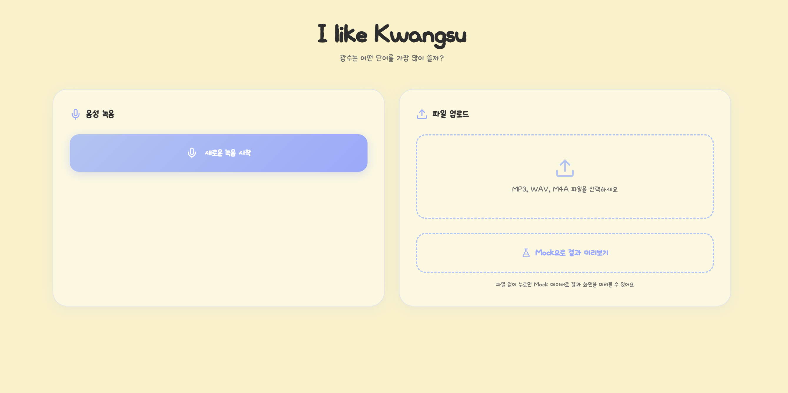
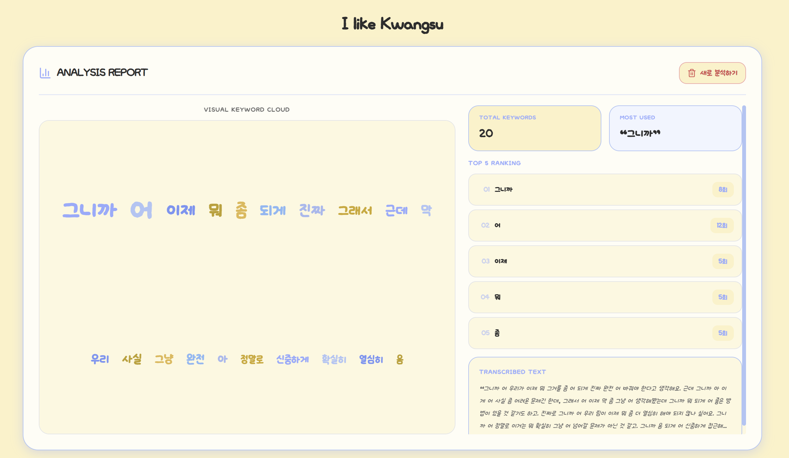
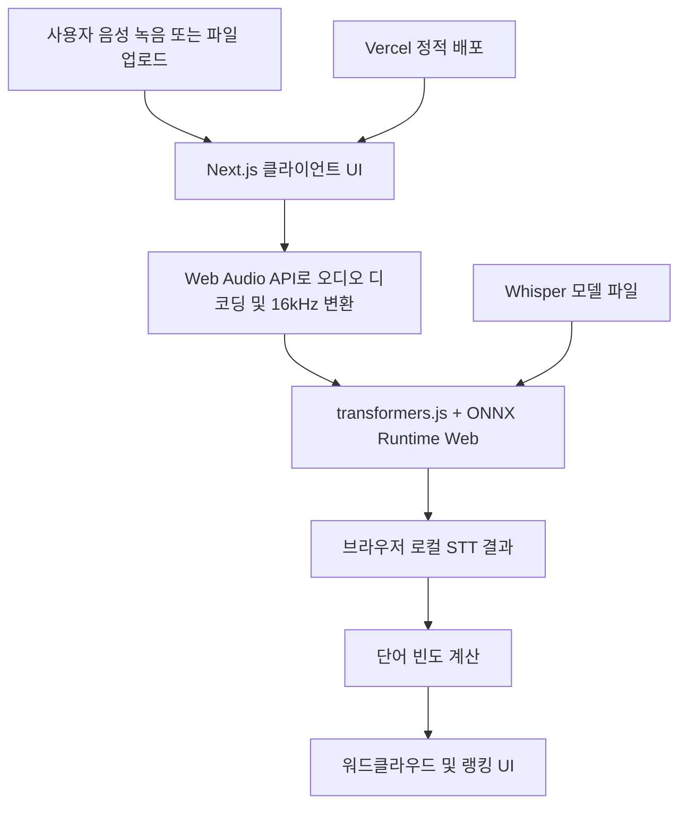

# I like Kwangsu

> 녹음하거나 업로드한 음성에서 자주 나온 한국어 단어를 보기 좋게 시각화하는 토이 프로젝트입니다.

이 프로젝트는 브라우저 안에서 직접 Whisper 계열 STT를 실행해 음성을 텍스트로 바꾸고, 자주 나온 단어를 워드클라우드와 랭킹으로 보여줍니다.  
외부 STT API를 호출하지 않기 때문에 별도 토큰이나 서버 인증 키 없이도 가볍게 배포할 수 있습니다.

배포 후 발생한 버그와 수정 이력은 `troubleshooting.md`에 누적합니다.

## 미리 보기

메인 화면  


분석 화면  


## 핵심 기능

- 브라우저에서 바로 마이크 녹음
- MP3, WAV, M4A 등 음성 파일 업로드
- 브라우저 로컬 Whisper 기반 한국어 음성 전사
- 자주 나온 단어 워드클라우드 시각화
- Top 5 단어 랭킹 제공
- 전사된 전체 텍스트 확인
- 파일 없이도 흐름을 확인할 수 있는 Mock Demo 모드

## 서비스 아키텍처



### 아키텍처 포인트

- 음성 전사는 서버가 아니라 브라우저 안에서 처리됩니다.
- `next.config.ts`의 `output: "export"` 설정으로 정적 사이트 형태로 빌드됩니다.
- 첫 분석 시에는 Whisper 모델 파일을 브라우저가 내려받은 뒤 캐시해서 사용합니다.
- 분석 로직은 로컬 실행이므로 STT 토큰 비용이 들지 않습니다.
- 현재 프로젝트에는 별도 API Route, 인증, 환경 변수 설정이 필요하지 않습니다.

## 기술 스택

- Next.js 16 App Router
- React 19
- Tailwind CSS v4
- `@huggingface/transformers`
- ONNX Runtime Web
- Web Audio API
- MediaRecorder API
- 커스텀 WordCloud 컴포넌트
- Lucide React

## 현재 분석 흐름

1. 사용자가 녹음하거나 음성 파일을 업로드합니다.
2. 브라우저가 오디오를 읽고 mono PCM, 16kHz 형식으로 정리합니다.
3. 로컬 Whisper 파이프라인이 음성을 한국어 텍스트로 변환합니다.
4. 전사된 텍스트를 공백 기준으로 나눠 단어 빈도를 계산합니다.
5. 결과를 워드클라우드, Top 5 랭킹, 전체 전사문으로 보여줍니다.

## 프로젝트 구조

```text
src/
├─ app/
│  ├─ globals.css
│  ├─ layout.tsx
│  ├─ mock/
│  │  └─ sttMockData.ts
│  └─ page.tsx
├─ components/
│  ├─ AnalysisReport.tsx
│  ├─ FileUploadCard.tsx
│  ├─ Header.tsx
│  ├─ RecordingCard.tsx
│  ├─ ResultBadges.tsx
│  ├─ TopRanking.tsx
│  ├─ TranscribedText.tsx
│  └─ WordCloud.tsx
└─ lib/
   ├─ audio/
   │  └─ decodeAudioFile.ts
   └─ stt/
      └─ localWhisper.ts
```

## 주요 파일 역할

- `src/app/page.tsx`
  메인 화면 상태 관리, 녹음과 파일 업로드 처리, 분석 시작과 결과 표시를 담당합니다.
- `src/lib/audio/decodeAudioFile.ts`
  업로드한 음성을 브라우저에서 디코딩하고 Whisper 입력용 16kHz mono PCM으로 변환합니다.
- `src/lib/stt/localWhisper.ts`
  브라우저 환경에 맞춰 WebGPU 또는 WASM 기반 Whisper 파이프라인을 준비하고 전사를 수행합니다.
- `src/components/AnalysisReport.tsx`
  분석 진행 상태와 결과 화면을 보여줍니다.
- `src/components/FileUploadCard.tsx`
  업로드 UI와 첫 분석 안내 문구를 담당합니다.

## 로컬 실행 방법

### 1. 의존성 설치

```bash
npm install
```

### 2. 개발 서버 실행

```bash
npm run dev
```

브라우저에서 `http://localhost:3000`을 열면 됩니다.

### 3. 프로덕션 빌드 확인

```bash
npm run build
```

정적 결과물은 `out/` 디렉터리에 생성됩니다.

이 프로젝트는 정적 export 기반이라 Vercel에 올리기 가장 편한 구조에 가깝습니다.

### 가장 간단한 배포 순서

1. GitHub에 현재 브랜치를 push합니다.
2. Vercel에서 `Add New Project`를 눌러 저장소를 import합니다.
3. Framework Preset이 `Next.js`로 자동 인식되는지 확인합니다.
4. Build Command는 기본값을 그대로 두거나 `npm run build`를 사용합니다.
5. 별도 환경 변수는 추가하지 않습니다.
6. `Deploy`를 눌러 배포합니다.
7. 배포 후 실제 서비스 URL에서 음성 업로드와 녹음 흐름을 테스트합니다.

### 배포 전 체크리스트

- `npm run lint` 통과
- `npm run build` 통과
- 데스크톱 Chrome 또는 Edge에서 실제 음성 분석 테스트
- 첫 분석이 다소 느릴 수 있다는 안내 문구 확인
- 데스크톱은 90초, 모바일 및 저사양 기기는 30초 이하 음성이 권장된다는 점 확인

### 배포 후 꼭 확인할 점

- 첫 분석은 모델 준비 때문에 일반 분석보다 더 오래 걸릴 수 있습니다.
- 이후 분석은 브라우저 캐시 덕분에 더 빨라질 수 있습니다.
- 브라우저와 기기 성능에 따라 속도 차이가 큽니다.
- WebGPU를 쓰지 못하는 환경에서는 자동으로 WASM 경로로 전환됩니다.

## 사용자 경험 메모

이 프로젝트에서 “첫 분석 시 모델 다운로드”는 개발자용 표현에 가깝습니다.  
서비스 화면에서는 사용자가 이해하기 쉬운 표현이 더 좋습니다.

예를 들면 아래처럼 안내하는 편이 자연스럽습니다.

- 첫 분석은 음성 인식 준비 때문에 조금 더 걸릴 수 있어요.
- 준비가 끝나면 다음 분석은 더 빨라집니다.
- 분석은 브라우저 안에서 진행되며 음성 파일은 외부 STT 서버로 전송하지 않습니다.

## 현재 한계

- 첫 분석 시 모델 준비 시간이 필요합니다.
- 저사양 모바일 기기에서는 속도가 느리거나 분석 가능한 길이가 더 짧을 수 있습니다.
- 현재 단어 분석은 공백 기준 단순 분리입니다.
- 조사나 어미가 포함된 형태 그대로 집계될 수 있습니다.
- 데스크톱은 90초 이하, 모바일 및 저사양 기기는 30초 이하 음성만 안정적으로 분석하도록 제한했습니다.

## 앞으로의 확장 방향

### 단기

- 불용어 필터 추가
- 단어 정규화 개선
- 결과 공유 이미지 저장
- 분석 이력 `localStorage` 저장

### 중기

- 한국어 형태소 분석 연동
- 시간축 기반 전사 구간 표시
- 여러 음성 파일 비교

### 장기

- 특정 화자 식별 또는 화자 검증 기능
- 여러 사람이 말해도 목표 화자의 음성만 골라내는 파이프라인
- 화자 분리와 화자 인증을 위한 별도 모델 도입
